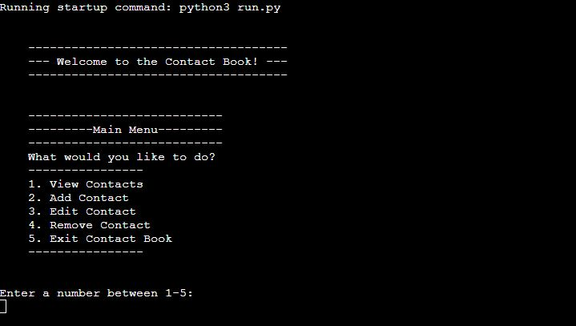
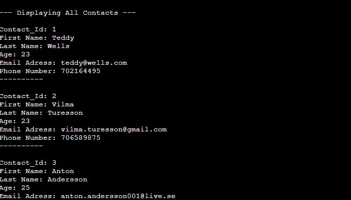
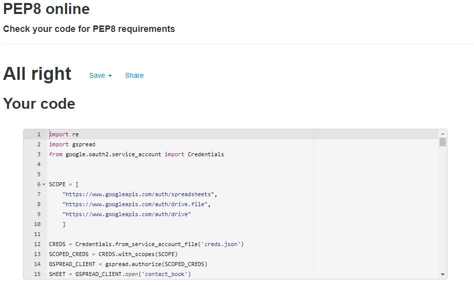

# Contact Book
A terminal based application developed using python aimed at providing the user with an intuitive way of viewing, storing and updating
contact information in google spreadsheet.

# Content
* [UX](#ux)
  * [User Stories](#user-stories)
  * [Site Owner Goals](#site-owner-goals)
  * [Data Structure](#data-structure)
* [Features](#features)
  * [Existing Features](#existing-features)
  * [Future additions](#future-additions)
* [Technologies Used](#technologies-used)
  * [Language](#language)
  * [Tools](#tools)
  * [Libraries](#libraries)
* [Testing](#testing)
  * [Validation](#validation)
  * [Bugs](#bugs)
* [Deployment](#deployment)
  * [Deployment steps](#deployment-steps)
* [Credits](#credits)

# UX
## User Stories
- As a user I want a menu that's easy to navigate through.
- As a user I want clear feedback on interactions with the application.
- As a user I want to be able to add new contacts.
- As a user I want to be able to view all stored contacts.
- As a user I want to be able to update existing contacts.
- As a user I want to be able to delete a specific user.

## Site Owner Goals
- As a site owner I want my functions to be dynamically applicable.
- As a site owner I want validation to ensure the correct data is inputted.
- As a site owner I want to make sure it's easy to add additional down the line.

## Data Structure
The data is stored using the Gspread library in a google sheets document consisting of one table. The ID acts as a unique primary key for the contact and will automatically be chosen on contact creation. It will take all existing ID's into account and add +1 to the number, making sure every contact has it's unique ID. 

Making queries to the spreadsheet aswell as updating and deleting a contact is therefore dependant on the contacts unique ID. I sought after addition in the future could come in the form of unique phone numbers aswell as E-mail adresses as they're in practice usually unique for each individual. 

### Contact
| Database Key  	| Type              	| Relationship 	|
|---------------	|-------------------	|--------------	|
| Contact_Id    	| Int(Unique)(Auto) 	| PK           	|
| First Name    	| Str               	|              	|
| Last Name     	| Str               	|              	|
| Age           	| Str               	|              	|
| E-Mail Adress 	| Str               	|              	|
| Phone Number  	| Str               	|              	|

# Features
## Existing Features
* Main Menu
  * When application is run it will welcome the user and present them with a menu consisting of 5 different options. Whenever an action has been completed or otherwise     cancelled by the user, they will return to this menu.
 
 
* View all contacts
  * Choosing this option will present a list of all stored contacts.
  * All contacts will be presented with the following information: First Name, Last Name, Age, E-mail Address & Phone Number alongside an ID that's automatically given
    on creation.
  * The user can press enter to continue to the main menu from here.
 
 
* Create new contact
  * When choosing this option the user will be asked to enter all necessary information. Starting with the name, followed by an age, E-mail address and a phone number.
  * The application will check if the user input is valid in relation to the requested information. Should validation fail, the user will be asked to provide the           information again.
  * Upon creation the new contact will automatically be given a unique contact id.
  * When the contact has been created, the user gets confirmation on the contact being created and then be redirected to the main menu.
 
 
* Edit contact
  * This option will ask the user to provide the id of the contact that the user wishes to edit.
  * If no ID is provided or the ID doesn't match any of the existing contacts. All existing contacts will be presented for reference.
  * If an existing ID is provided, the matched contact will be displayed. The user will have the option to proceed with editing the contact or cancelling.
  
  * If the user continues the application will, much like contact creation, prompt the user to input all necessary information. 
  * Finally when all information has been provided, the application will once again ask the user to confirm the changes. If cancelled, none of the changes will apply       and the user will return to the main menu.
 
 
* Delete contact
  * If chosen the user will be asked to provide the ID of the contact they wish to remove.
  * If none or unmtached ID is provided, all contacts will be displayed.
  * If matching ID is provided, the corresponding contact will be displayed and a message will require the user to confirm the deletion by either entering "Y" for Yes     or "N" for No. Either of these options will return the user to the main menu.
 
 
* Exit program
  * Simply an option to exit the application.

## Future additions
* Search Contact
  * Being able to search contacts using either the name, email address or phone number. This could in turn make the Edit och Delete functionality easier to use.
* Edit single line
  * Being able to edit only the requested information without having to edit the entire contact. This would alleviate some unecessary changes made to a contact.

# Technologies Used
## Language
* Python3 - Raw Python code was used for this project.

## Tools
* [Google sheets](https://www.google.com/sheets/about/) - Google Sheets was used to store the data.

## Libraries
- [Gspread](https://docs.gspread.org/en/latest/) - CRUD functionality to store data.
- [Re](https://docs.python.org/3/library/re.html) - Validation of user input

## Validation
PEP8 Validator returned 0 issues.

## Testing
- Initially the intention was to create the application using a OOP approach. This would have been easier if the data was stored locally in a seperate file. However when trying to create and update data with the Gspread library i ran in to multiple issues regarding object data types not being accepted by the Gspread methods provided. To remedy this I had to destructure my contact objects in to lists and vice versa. So to avoid any unecessary hurdles I switched approach.

- Testing the application I went through the process of both creating, updating and deleting, however at every step of the way I entered the wrong information. Both updating a contact and creating a contact are validated using the same functions. When inputting numbers for names, letters for phone number and age aswell as a faulty email address, the application is responding to the wrongful input as expected. The same thing happens if nothing is provided at all as the validation requires that certain criteria are met for each input field.

* One issue found was when confirming the deletion of a contact:
- Entering "N" for no deletion resulted in the user being returned to main menu, while entering neither "Y" / "N" prompts the user for another ID which is the expected result of "N". Therefore a new "Q" option was added for the user to return to the main menu while "N" instead gives the expected result. 
  
## Bugs
* <strong>Problem</strong> 🐞: Application on Heroku returned a 404 Error.
* <strong>Cause</strong>🛠: Python Essentials Template files were missing since project was created without it.
* <strong>Resolution</strong>✅: Manually added all files and folders included in the Code Institute Python Template.
---
* <strong>Problem</strong> 🐞: If statement in edit_contact checking if display_contact returned a user, returned None
* <strong>Cause</strong>🛠: display_contact returned only a print of the contact data which resulted in None after loop was finished.
* <strong>Resolution</strong>✅: Make display_contact return the contact_id after print statements if contact was found, return False if not found. This way         edit_contact if statement could check for True/False Bool.
---
* <strong>Problem</strong> 🐞: Gspread update() didn't update worksheet and returned an error.
* <strong>Cause</strong>🛠: Second parameter was given a list of contact data. Gspread required a nested list within a list.
* <strong>Resolution</strong>✅: Used seperate "create_contact_list()" function to return a list of contact data. Passed the list of data into a variable which was then stored in it's own list and passed as the second parameter.

# Deployment
The project was deployed to Heroku.

## Deployment Steps
1. Log in to Heroku
2. Create a Project
3. Add buildpacks Python & Node.js
4. Add Config Vars: Key: PORT, Value: 8000
5. Go to deployment tab
6. Link GitHub account with Heroku project
7. Select GitHub repository
8. Click on Deploy Branch
9. Automatic deployments applied.
10. Application accessible via following link - https://contact-storage.herokuapp.com/

## Credits 
Credit goes to my mentor Richard Wells for inspiration of possible functionality and good markdown best practices.

